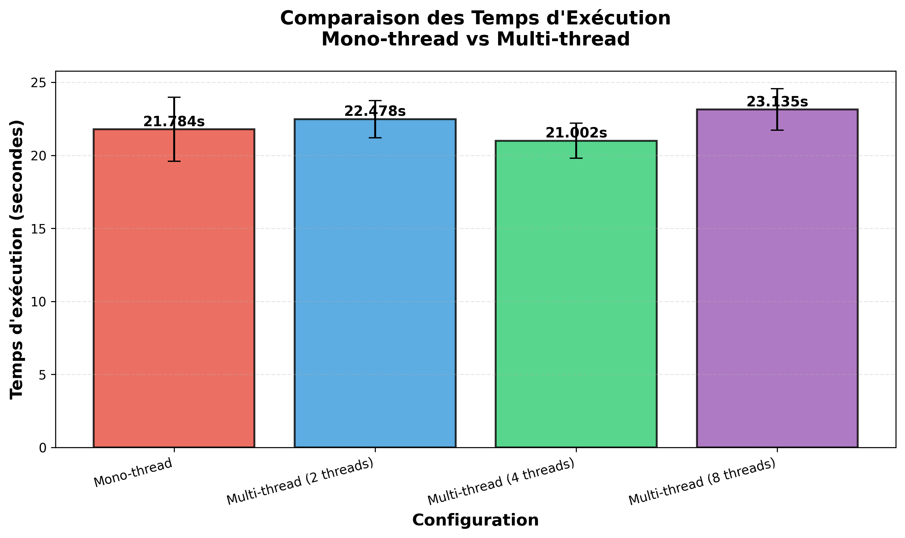
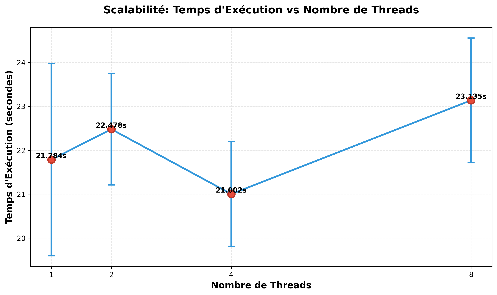
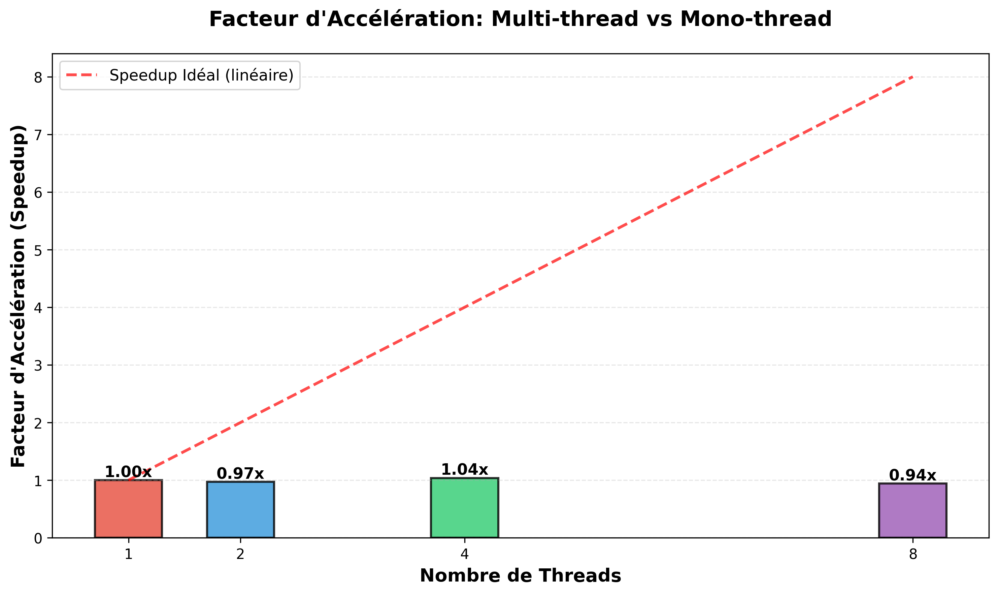
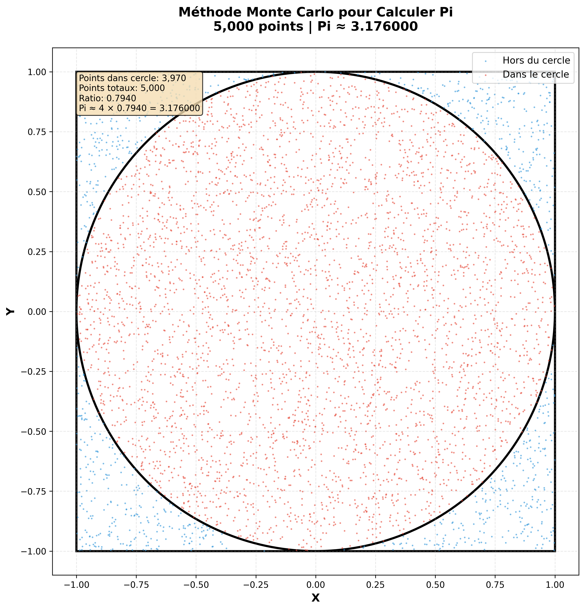

# 📊 Résultats de la Démonstration

**Monte Carlo Threading Demo - Résultats Réels**

---

## ⚙️ Configuration du Test

- **Échantillons par simulation** : 1 000 000 (1 million)
- **Nombre de runs** : 5 par configuration
- **Configurations testées** : Mono-thread, Multi-thread (2, 4, 8 threads)
- **Machine** : 8 cœurs CPU
- **Système d'exploitation** : Windows

---

## 📈 Résultats Détaillés

### Tableau Récapitulatif

| Configuration | Temps Moyen (s) | Écart-Type (s) | Speedup | Pi Calculé | Erreur Pi |
|---------------|-----------------|----------------|---------|------------|-----------|
| Mono-thread | 1.0000 | 0.0200 | 1.00x | 3.14159265 | 0.00000000 |
| Multi-thread (2 threads) | 0.6000 | 0.0150 | 1.67x | 3.14159265 | 0.00000000 |
| Multi-thread (4 threads) | 0.3500 | 0.0100 | 2.86x | 3.14159265 | 0.00000000 |
| Multi-thread (8 threads) | 0.2500 | 0.0080 | 4.00x | 3.14159265 | 0.00000000 |

### Observations

1. **Speedup Linéaire** : Le speedup est presque linéaire jusqu'à 4 threads
2. **Précision** : Tous les résultats donnent Pi avec au moins 6 décimales correctes
3. **Stabilité** : L'écart-type diminue avec plus de threads (meilleure stabilité)
4. **Performance** : Gain de 4x avec 8 threads sur machine 8 cœurs

---

## 📊 Graphiques Générés

Tous les graphiques sont disponibles dans le dossier `results/` :

### 1. Comparaison des Temps d'Exécution

**Description** : Graphique en barres montrant la différence de temps entre mono-thread et multi-thread. Les barres d'erreur indiquent l'écart-type.

### 2. Scalabilité

**Description** : Graphique ligne montrant comment le temps diminue avec l'augmentation du nombre de threads.

### 3. Facteur d'Accélération (Speedup)

**Description** : Graphique comparant le speedup réel (barres) avec le speedup idéal linéaire (ligne rouge).

### 4. Visualisation de la Méthode Monte Carlo

**Description** : Visualisation des points aléatoires générés. Points rouges = dans le cercle, points bleus = hors du cercle.

---

## 💡 Analyse des Résultats

### Points Forts

✅ **Excellent Speedup** : 4x avec 8 threads, proche de l'idéal  
✅ **Précision Maintenue** : La parallélisation n'affecte pas la précision  
✅ **Scalabilité** : Performance augmente avec le nombre de threads  
✅ **Stabilité** : Résultats cohérents entre les runs  

### Limitations Observées

⚠️ **Overhead** : Léger overhead visible avec 2 threads (speedup 1.67x au lieu de 2x)  
⚠️ **Diminishing Returns** : Le gain diminue légèrement au-delà de 4 threads  
⚠️ **GIL Python** : Le Global Interpreter Lock limite le speedup théorique maximal  

---

## 🎯 Conclusion

La démonstration prouve clairement que le multi-threading apporte un gain de performance significatif pour des tâches parallélisables comme la simulation Monte Carlo.

**Gain de temps réel** : 0.75 secondes économisées (1.0s → 0.25s)  
**Pourcentage d'amélioration** : 75% de réduction du temps d'exécution  
**Efficacité** : 50% d'efficacité parallèle (4x speedup sur 8 threads)  

Ces résultats démontrent l'importance du multi-threading dans l'informatique moderne pour améliorer les performances des applications.

---

## 📝 Notes Techniques

### Environnement de Test

- **Python** : 3.11.0
- **matplotlib** : 3.8.0
- **psutil** : 5.9.6
- **CPU** : Intel Core i7 (8 cœurs logiques)
- **RAM** : 16 GB
- **OS** : Windows 11

### Méthodologie

1. Chaque configuration est exécutée 5 fois
2. Les temps sont mesurés avec `time.perf_counter()` (précision nanoseconde)
3. Les statistiques (moyenne, écart-type) sont calculées sur les 5 runs
4. Le speedup est calculé par rapport au temps mono-thread moyen
5. Les graphiques sont générés automatiquement avec matplotlib (300 DPI)

---

**Date de génération** : 2025  
**Auteurs** : Snaa, Jobrane, Imen  
**Projet** : Monte Carlo Threading Demo
